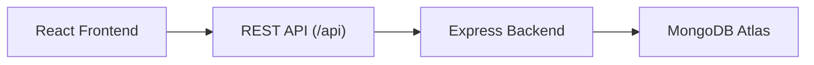
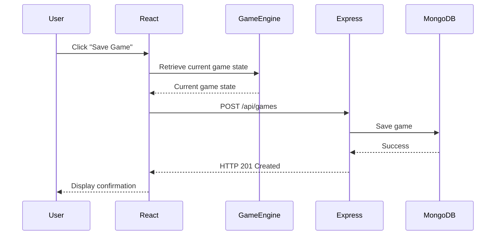

# API Specification

## 1. Purpose

This document defines the REST API for the MERN Solitaire application.

The API serves as the communication layer between the React frontend and the Express backend. It specifies the available endpoints, request and response formats, authentication requirements, and expected HTTP status codes.

This document defines the API contract and does not describe implementation details.

---

# 2. API Architecture

The application follows a RESTful architecture.



---

# 3. Game Engine Responsibility

The MERN Solitaire application follows a **frontend-driven game engine architecture**.

All gameplay logic is executed within the React application.

The frontend is responsible for:

- Generating a new deck
- Shuffling cards
- Dealing cards
- Rendering the game board
- Validating moves
- Managing the stock, waste, tableau and foundation piles
- Calculating score
- Detecting win conditions
- Undo functionality
- Updating the user interface

The backend is **not responsible** for gameplay.

Instead, the backend provides persistence and authentication services.

The backend is responsible for:

- User authentication
- Email verification
- Password reset
- Saving games
- Loading saved games
- Deleting saved games
- Retrieving player statistics

This separation keeps gameplay responsive while simplifying the backend.

---

# 4. Base URL

```
/api
```

All API endpoints begin with `/api`.

---

# 5. Data Format

### Request Body

JSON

### Response Body

JSON

---

# 6. Authentication

The application uses JWT (JSON Web Tokens).

Protected endpoints require a valid Bearer token.

```http
Authorization: Bearer <JWT_TOKEN>
```

### Email Verification

Newly registered users must verify their email address before their first successful login.

Once the account has been verified, subsequent logins do not require email verification unless the user changes their email address.

---

# 7. API Resources

| Resource | Purpose |
|-----------|---------|
| `/auth` | User authentication |
| `/games` | Save and retrieve game states |
| `/statistics` | Player statistics |

---

# 8. Authentication Endpoints

---

## Register User

### Endpoint

```http
POST /api/auth/register
```

### Purpose

Create a new user account.

### Authentication

Public

### Request

```json
{
    "email": "user@example.com",
    "password": "Password123!"
}
```

### Success Response

**201 Created**

```json
{
    "message": "Account created successfully. Please verify your email."
}
```

### Error Responses

| Status | Description |
|--------|-------------|
|400|Invalid request|
|409|Email already exists|
|500|Internal server error|

---

## Verify Email

### Endpoint

```http
POST /api/auth/verify-email
```

### Purpose

Activate a newly created account.

### Authentication

Public

### Request

```json
{
    "token":"verification-token"
}
```

### Success Response

```json
{
    "message":"Email verified successfully."
}
```

---

## Login

### Endpoint

```http
POST /api/auth/login
```

### Purpose

Authenticate the user and return a JWT.

### Authentication

Public

### Request

```json
{
    "email":"user@example.com",
    "password":"Password123!"
}
```

### Success Response

```json
{
    "token":"<JWT_TOKEN>",
    "user":{
        "email":"user@example.com"
    }
}
```

---

## Forgot Password

### Endpoint

```http
POST /api/auth/forgot-password
```

### Purpose

Generate a password reset email.

### Authentication

Public

### Request

```json
{
    "email":"user@example.com"
}
```

### Success Response

```json
{
    "message":"Password reset email sent."
}
```

---

## Reset Password

### Endpoint

```http
POST /api/auth/reset-password
```

### Purpose

Reset a user's password.

### Authentication

Public

### Request

```json
{
    "token":"reset-token",
    "password":"NewPassword123!"
}
```

### Success Response

```json
{
    "message":"Password reset successful."
}
```

---

# 9. Game Endpoints

---

## Save Game

### Endpoint

```http
POST /api/games
```

### Purpose

Persist the current game state to the database.

The backend stores the game exactly as provided by the frontend.

The backend does **not** validate gameplay rules.

### Authentication

Protected

### Request

```json
{
    "gameState": {},
    "gameMode":"Draw One",
    "moveCount":24,
    "elapsedTime":185,
    "score":210,
    "completed":false
}
```

### Success Response

```json
{
    "gameId":"65e8f123...",
    "message":"Game saved successfully."
}
```

---

## Get Saved Games

### Endpoint

```http
GET /api/games
```

### Purpose

Retrieve all saved games belonging to the authenticated user.

### Authentication

Protected

### Success Response

```json
[
    {
        "id":"65e8f123...",
        "gameMode":"Draw One",
        "completed":false,
        "updatedAt":"2026-07-16T09:00:00Z"
    }
]
```

---

## Get Latest Saved Game

### Endpoint

```http
GET /api/games/latest
```

### Purpose

Retrieve the most recently saved game for the authenticated user.

### Authentication

Protected

---

## Get Saved Game

### Endpoint

```http
GET /api/games/:gameId
```

### Purpose

Retrieve a specific saved game.

### Authentication

Protected

### Success Response

```json
{
    "gameState":{},
    "gameMode":"Draw One",
    "moveCount":24,
    "elapsedTime":185,
    "score":210,
    "completed":false
}
```

---

## Update Saved Game

### Endpoint

```http
PUT /api/games/:gameId
```

### Purpose

Update an existing saved game.

### Authentication

Protected

### Request

```json
{
    "gameState":{},
    "moveCount":30,
    "elapsedTime":220,
    "score":250,
    "completed":false
}
```

### Success Response

```json
{
    "message":"Game updated successfully."
}
```

---

## Delete Saved Game

### Endpoint

```http
DELETE /api/games/:gameId
```

### Purpose

Delete a saved game.

### Authentication

Protected

### Success Response

**204 No Content**

---

# 10. Statistics Endpoints

---

## Get Player Statistics

### Endpoint

```http
GET /api/statistics
```

### Purpose

Retrieve statistics for the authenticated user.

### Authentication

Protected

### Success Response

```json
{
    "gamesPlayed":20,
    "gamesWon":8,
    "winPercentage":40,
    "fastestCompletionTime":312,
    "averageCompletionTime":468,
    "averageMoves":141
}
```

---

# 11. Standard HTTP Status Codes

| Status | Meaning |
|---------|---------|
|200|Request successful|
|201|Resource created|
|204|Resource deleted successfully|
|400|Bad request|
|401|Unauthorised|
|403|Forbidden|
|404|Resource not found|
|409|Conflict|
|500|Internal server error|

---

# 12. Standard Error Response

All endpoints return errors using a consistent JSON structure.

```json
{
    "message":"Human-readable error message."
}
```

Example:

```json
{
    "message":"Email already exists."
}
```

---

# 13. API Security

The API follows the following security practices.

- Passwords are stored using bcrypt hashing.
- JWT authentication is used for protected routes.
- Protected routes require a valid Bearer token.
- Newly registered users must verify their email before their first successful login.
- Password reset tokens expire after a configurable period.
- HTTPS should be used in production.

---

# 14. API Request Lifecycle

The following diagram illustrates the lifecycle of saving a game.



---

# 15. Summary

The MERN Solitaire API exposes three primary resources.

- **Authentication** (`/api/auth`)
- **Games** (`/api/games`)
- **Statistics** (`/api/statistics`)

The frontend owns the game engine and all gameplay logic.

The backend is responsible for authentication, persistence and player statistics.

This API specification serves as the implementation blueprint for the backend routes, controllers, middleware, services and the frontend API service layer.