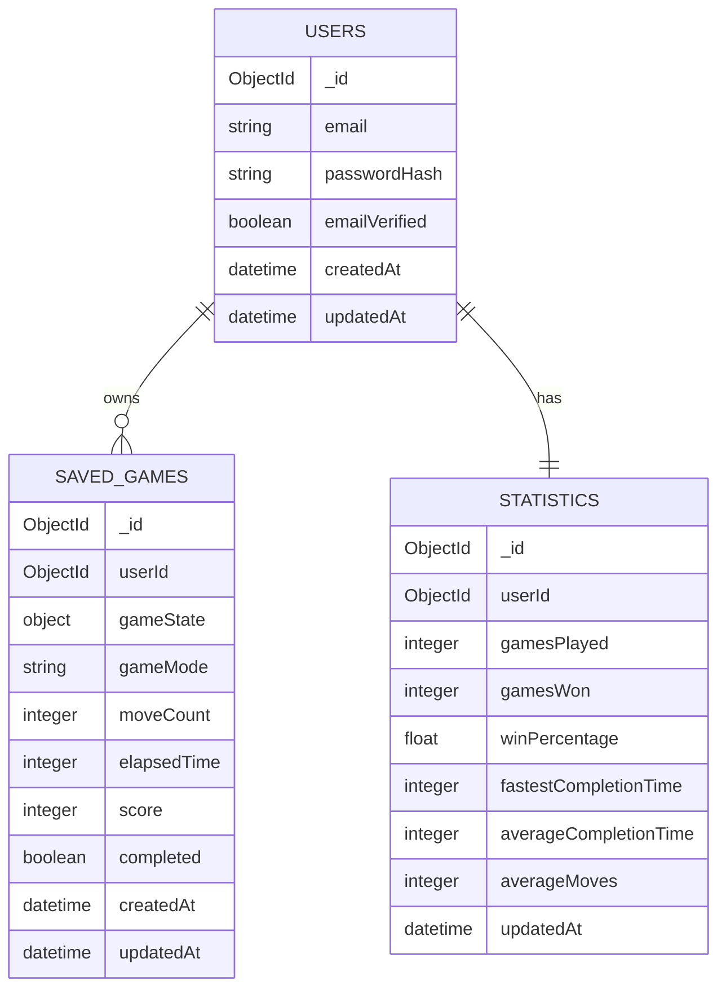

# Database Schema

## 1. Purpose

This document defines the logical database schema for the **MERN Solitaire** application.

The objective of this document is to describe how application data is organised, stored and related within MongoDB. It serves as the blueprint for implementing the Mongoose models during development.

This document focuses on **what data is stored**, not **how it is implemented**.

---

# 2. Database Overview

The MVP consists of three primary collections:

* **Users**
* **SavedGames**
* **Statistics**

The database is intentionally kept simple to minimise complexity while supporting all MVP user stories.

---

# 3. Entity Relationship Diagram



---

# 4. Collection Definitions

## Users

### Purpose

Stores registered user accounts and authentication information.

### Fields

| Field         | Type     | Required | Description                                          |
| ------------- | -------- | :------: | ---------------------------------------------------- |
| _id           | ObjectId |    Yes   | MongoDB generated unique identifier                  |
| email         | String   |    Yes   | Unique email address used for login                  |
| passwordHash  | String   |    Yes   | Encrypted password hash                              |
| emailVerified | Boolean  |    Yes   | Indicates whether the user's email has been verified |
| createdAt     | Date     |    Yes   | Account creation timestamp                           |
| updatedAt     | Date     |    Yes   | Last profile update timestamp                        |

### Notes

* Email is the unique identifier for each user.
* Plain text passwords are never stored.
* Passwords are stored only as hashed values.

---

## SavedGames

### Purpose

Stores the complete state of a Klondike Solitaire game.

The entire game state is stored as a single MongoDB document, allowing a game to be restored with one database query.

### Fields

| Field       | Type     | Required | Description                                    |
| ----------- | -------- | :------: | ---------------------------------------------- |
| _id         | ObjectId |    Yes   | MongoDB generated unique identifier            |
| userId      | ObjectId |    Yes   | Reference to the Users collection              |
| gameState   | Object   |    Yes   | Complete game state                            |
| gameMode    | String   |    Yes   | Selected game mode (e.g. Draw One, Draw Three) |
| moveCount   | Number   |    Yes   | Number of moves made                           |
| elapsedTime | Number   |    Yes   | Elapsed time in seconds                        |
| score       | Number   |    Yes   | Current game score (for future)                             |
| completed   | Boolean  |    Yes   | Indicates whether the game has been completed  |
| createdAt   | Date     |    Yes   | Game creation timestamp                        |
| updatedAt   | Date     |    Yes   | Last save timestamp                            |

### Game State Structure

The `gameState` object contains all information required to restore a game.

| Property     | Description                             |
| ------------ | --------------------------------------- |
| stock        | Remaining cards in the stock pile       |
| waste        | Cards currently in the waste pile       |
| foundations  | Four foundation piles                   |
| tableau      | Seven tableau columns                   |
| history      | Previous game states used for Undo      |
| selectedCard | Currently selected card (if applicable) |

Example:

```json
{
  "stock": [],
  "waste": [],
  "foundations": [],
  "tableau": [],
  "history": [],
  "selectedCard": null
}
```

---

## Statistics

### Purpose

Stores aggregated player statistics.

These values are updated after each completed game rather than recalculated whenever the user logs in.

### Fields

| Field                 | Type     | Required | Description                         |
| --------------------- | -------- | :------: | ----------------------------------- |
| _id                   | ObjectId |    Yes   | MongoDB generated unique identifier |
| userId                | ObjectId |    Yes   | Reference to the Users collection   |
| gamesPlayed           | Number   |    Yes   | Total games played                  |
| gamesWon              | Number   |    Yes   | Total games won                     |
| winPercentage         | Number   |    Yes   | Percentage of games won             |
| fastestCompletionTime | Number   |    Yes   | Fastest completed game (seconds)    |
| averageCompletionTime | Number   |    Yes   | Average completion time             |
| averageMoves          | Number   |    Yes   | Average moves per completed game    |
| updatedAt             | Date     |    Yes   | Last statistics update              |

---

# 5. Collection Relationships

## Users → SavedGames

**One User → Many Saved Games**

Each user may own multiple saved games.

Each saved game belongs to exactly one user.

---

## Users → Statistics

**One User → One Statistics Record**

Each user owns a single statistics document.

The document is updated whenever a game is completed.

---

# 6. Validation Rules

## Users

| Field         | Validation                           |
| ------------- | ------------------------------------ |
| email         | Required, unique, valid email format |
| passwordHash  | Required                             |
| emailVerified | Defaults to false                    |

---

## SavedGames

| Field       | Validation                           |
| ----------- | ------------------------------------ |
| userId      | Required                             |
| gameState   | Required                             |
| moveCount   | Must be zero or greater              |
| elapsedTime | Must be zero or greater              |
| score       | Must be zero or greater              |
| gameMode    | Allowed values: Draw One, Draw Three |
| completed   | Boolean                              |

---

## Statistics

| Field         | Validation                |
| ------------- | ------------------------- |
| gamesPlayed   | Zero or greater           |
| gamesWon      | Cannot exceed gamesPlayed |
| winPercentage | Between 0 and 100         |
| averageMoves  | Zero or greater           |

---

# 7. Indexing Strategy

The MVP requires only three indexes.

| Collection | Index             | Purpose                                      |
| ---------- | ----------------- | -------------------------------------------- |
| Users      | `email` (Unique)  | Login and prevent duplicate accounts         |
| SavedGames | `userId`          | Retrieve all saved games belonging to a user |
| Statistics | `userId` (Unique) | Retrieve a user's statistics efficiently     |

Additional indexes can be introduced as new features require them.

---

# 8. Design Decisions

## Why MongoDB?

A Solitaire game is naturally represented as a nested document. MongoDB stores this structure efficiently without requiring multiple relational tables.

---

## Why Store the Entire Game State?

Instead of storing every card movement individually, the application stores the complete game state in a single document.

Benefits include:

* Single database query to restore a game.
* Simpler application logic.
* Better performance.
* Lower implementation complexity.

---

## Why Store Statistics Separately?

Statistics are updated after each completed game, avoiding repeated calculations every time the user signs in.

---

## Why Use Email as the User Identifier?

Email addresses are already required for authentication, account verification and password recovery.

Using email as the unique identifier simplifies the data model while eliminating the need for separate usernames.

---

# 9. Future Database Considerations

Future versions of the application may introduce additional collections, including:

* Achievements
* Daily Challenges
* Leaderboards
* Game Replays
* User Preferences
* Themes
* Card Designs

These collections are intentionally excluded from the MVP.

---

# 10. Summary

The MVP database consists of three collections:

* **Users** – Authentication and account information.
* **SavedGames** – Complete persisted game state.
* **Statistics** – Aggregated player performance.

The schema is intentionally simple, scalable and aligned with the project's MVP objectives while providing a strong foundation for future enhancements.
