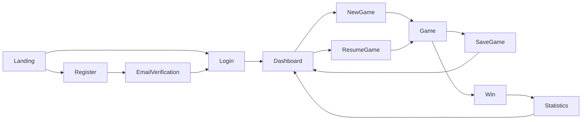
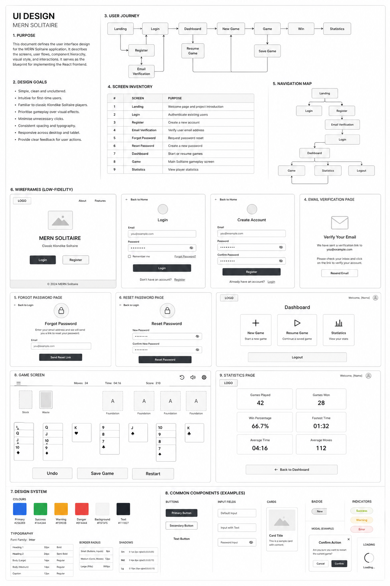
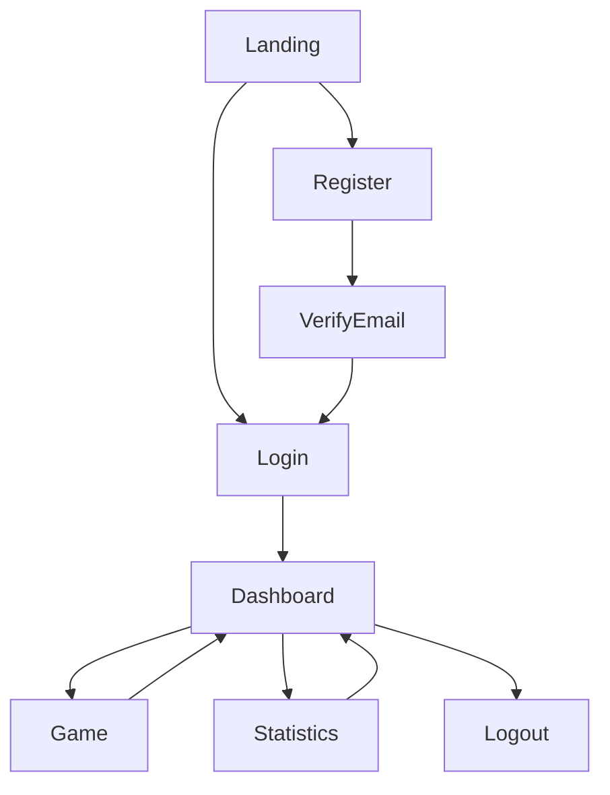
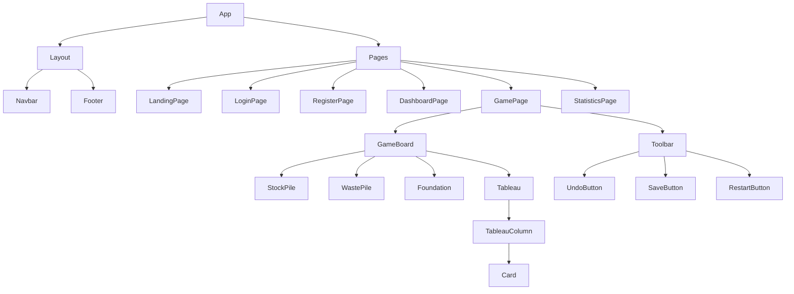

# UI Design

## 1. Purpose

This document defines the user interface design for the MERN Solitaire application. It describes the application's screens, user flows, component hierarchy, navigation and design principles. It serves as the blueprint for implementing the React frontend.

---

# 2. Design Goals

- Simple and uncluttered
- Familiar to classic Klondike Solitaire players
- Responsive (desktop-first)
- Component-based
- Accessible
- Consistent spacing and typography

---

# 3. User Journey

---

# 4. Screen Inventory

| Screen | Purpose |
|---------|---------|
| Landing | Welcome page |
| Login | User authentication |
| Register | Create account |
| Email Verification | Verify email |
| Forgot Password | Request password reset |
| Reset Password | Set new password |
| Dashboard | Start or resume games |
| Game | Play Solitaire |
| Statistics | View player statistics |

---

# 5. Low-Fidelity Wireframes

The following low-fidelity wireframes define the intended layout for the MVP screens.

 

These wireframes are intended to guide implementation rather than represent the final visual design. Spacing, colours and typography may evolve during development.

---

# 6. Navigation

---

# 7. Component Hierarchy

---

# 8. Design System

## Colour Palette

| Element | Colour |
|----------|---------|
| Background | Dark Green |
| Cards | White |
| Text | Black |
| Primary Button | Blue |
| Success | Green |
| Warning | Orange |
| Error | Red |

## Typography

- Font Family: Inter
- Consistent heading hierarchy
- Desktop-first sizing

---

# 9. Common Components

- Card
- Tableau Column
- Foundation Pile
- Stock Pile
- Waste Pile
- Timer
- Move Counter
- Score
- Login Form
- Register Form
- Primary Button
- Modal
- Loading Spinner

---

# 10. Responsive Design

- Desktop-first
- Tablet supported
- Mobile is outside the MVP scope

---

# 11. Accessibility

- Keyboard-friendly controls where practical
- Good colour contrast
- Semantic HTML
- Visible focus states

---

# 12. Future Enhancements

- Dark mode
- Themes
- Sound effects
- Card animations
- Achievements
- Leaderboards
- Mobile optimisation

---

# 13. Summary

The UI is intentionally minimal and gameplay-focused. The low-fidelity wireframes provide the reference layout for implementing the React frontend while leaving visual styling to a later phase.
